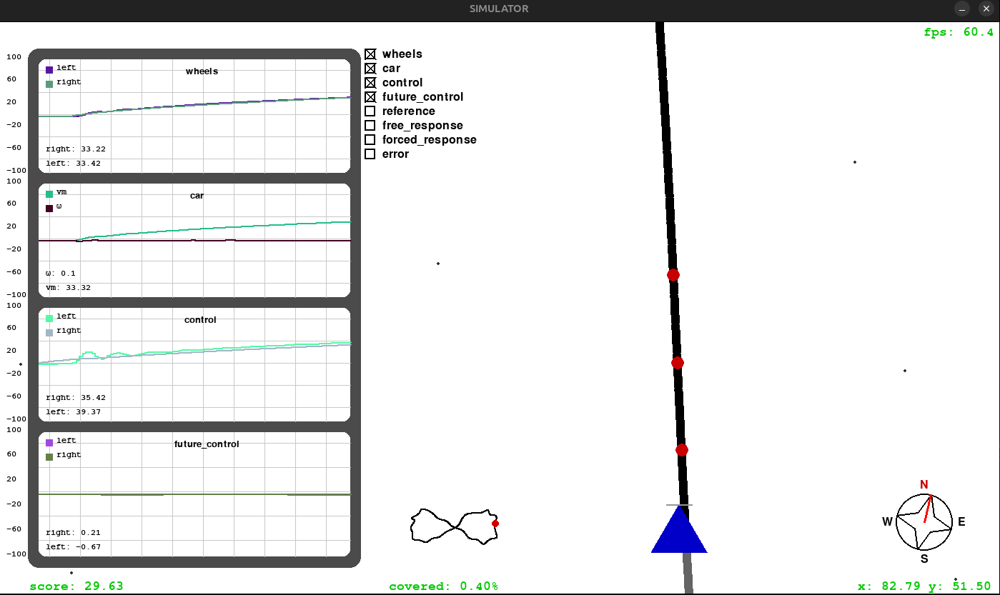

# Line Follower Simulator

## Description
The **Line Follower Simulator** is a simulator for a line-following robot. It allows testing control algorithms and simulating the behavior of a robot on different types of tracks.

## Features
- Simulation of line-following robots.
- Generation of tracks in different formats (circle, lemniscate).
- Graphical visualization of the robot's behavior.

## Project Structure
- `main.py`: Main file to start the simulation.
- `simulator.py`: Implementation of the simulator.
- `car_dynamics.py`: Modeling of the car's dynamics.
- `track_generator.py`: Track generation.
- `graphics_elements.py`: Graphical elements for rendering.

## Requirements
- Python 3.10 or higher.
- Required libraries:
  - `pygame`
  - `pandas`
  - `numpy`
  - `time`
  - `scipy`
  - `random`
